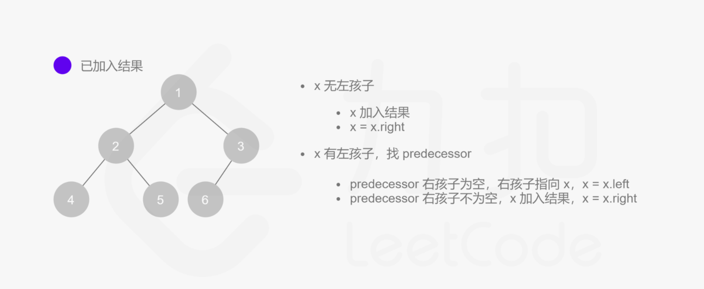

# 94. 二叉树的中序遍历

### [二叉树的中序遍历](https://leetcode-cn.com/problems/binary-tree-inorder-traversal/)

### 原题：

给定一个二叉树的根节点 `root` ，返回它的 **中序** 遍历。

**示例 1：** 

```
输入：root = [1,null,2,3]
输出：[1,3,2]
```

**示例 2：**

```
输入：root = []
输出：[]
```

**示例 3：**

```
输入：root = [1]
输出：[1]
```

**示例 4：** 

```
输入：root = [1,2]
输出：[2,1]
```

**示例 5：** 

```
输入：root = [1,null,2]
输出：[1,2]
```

**提示：**

* 树中节点数目在范围 `[0, 100]` 内
* `-100 <= Node.val <= 100`

**进阶:** 递归算法很简单，你可以通过迭代算法完成吗？

### 解题方法：

解法一（递归）：

```cpp
class Solution {
public:
    vector<int> vec;
    vector<int> inorderTraversal(TreeNode* root) {
        if(!root) return {};
        Inorder(root);
        return vec;
    }

    void Inorder(TreeNode* root)
    {
        if(!root) return;
        Inorder(root->left);
        vec.push_back(root->val);
        Inorder(root->right);
    }
};
```

解法二（**颜色标记法**）：

```cpp
class Solution {
public:
    vector<int> vec;
    vector<int> inorderTraversal(TreeNode* root) {
        //if(!root) return {};     //此处这个也不需要了，因为后面有个判断
        stack<pair<TreeNode*,int>> st;
        st.push(make_pair(root,0));
        while(!st.empty())
        {
            auto [node,type]=st.top();
            st.pop();
            if(node==nullptr) continue;
            if(type==0)
            {
                st.push(make_pair(node->right,0));  //先右
                st.push(make_pair(node,1));
                st.push(make_pair(node->left,0));   //后左
            }
            else
            {
                vec.push_back(node->val);
            }
        }
        return vec;
    }
};
```

解法三（莫里斯遍历，能把空间复杂度降至O(1)）：

```cpp
class Solution {
public:
    vector<int> inorderTraversal(TreeNode* root) {
        TreeNode* predecessor=nullptr;    //指向当前结点左子树上进行中序遍历的最后一个结点
        vector<int> res;
        while(root)
        {
            if(root->left)
            {
                // predecessor 节点就是当前 root 节点向左走一步，然后一直向右走至无法走为止
                predecessor = root->left;
                while (predecessor->right != nullptr && predecessor->right != root) 
                {
                    predecessor = predecessor->right;
                }
            
                if (predecessor->right == nullptr) 
                {
                    predecessor->right = root;
                    root = root->left;
                }
                // 说明左子树已经访问完了，我们需要断开链接
                else
                {
                    res.push_back(root->val);
                    predecessor->right = nullptr;
                    root = root->right;
                }
            }
            else   //如果没有左孩子，直接访问右孩子
            {
                res.push_back(root->val);
                root=root->right;
            }
        }
        return res;
    }
};
```

### 做题小结：

针对解法二：

1. 该解法是在leetcode的解法区看到的大佬解法\[[点击此处](https://leetcode-cn.com/problems/binary-tree-inorder-traversal/solution/yan-se-biao-ji-fa-yi-chong-tong-yong-qie-jian-ming/)]，这种解法的妙处在于前中后用栈迭代遍历都能使用几乎一样的模板。
2.  核心思想就是给没有遍历过的结点标记为白色，遍历过的结点就标记为红色，每次循环就先判断该结点是否为空结点，然后查看是否遍历过：

    &#x20;        没有遍历过->将该结点按自己想要遍历的顺序入栈（前序就右、左、中，中序就右、中、左，后序就中、右、左，始终是自身置1，左右结点置0）

    &#x20;        已经遍历过->对该结点进行操作

针对解法三：

1. 这种解法降低空间复杂度的方式就是给每个结点的左子树的中序遍历的最后一个结点留下回到当前结点的方式，即让predecessor->right=x，这样在遍历完之后就可以直接回去，而不需要用栈



其他：

使用栈的常规迭代算法请访问\[[迭代法](https://leetcode-cn.com/problems/binary-tree-inorder-traversal/solution/die-dai-fa-by-jason-2/)]
